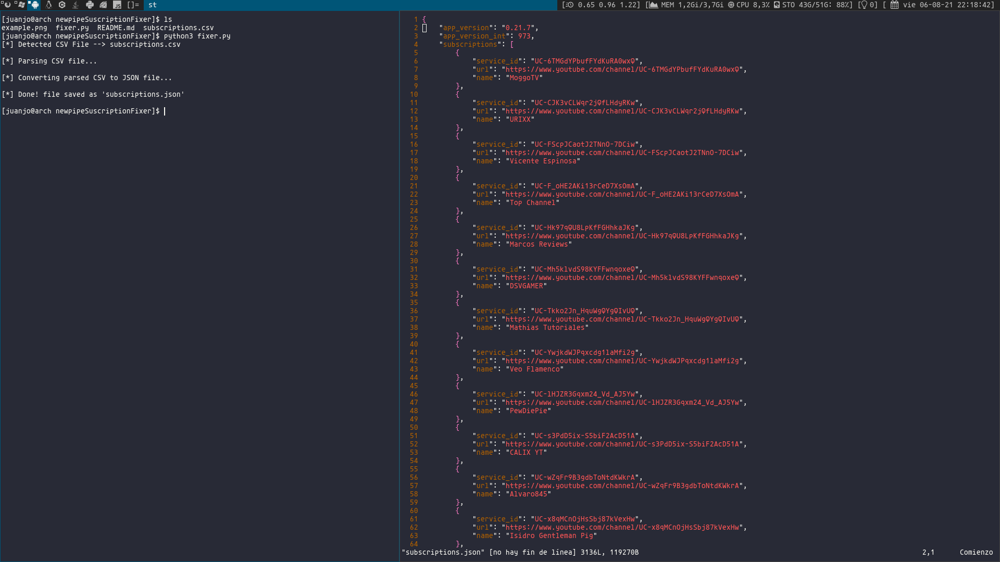

# Newpipe-CSV-Fixer

Convert your Google subscriptions CSV file into a valid JSON for Newpipe!

Thanks to [nikcorg](https://www.reddit.com/r/NewPipe/comments/oprw6d/google_takeouts_exporting_in_csv_format/h7qlevp?utm_source=share&utm_medium=web2x&context=3) for sharing how
to convert the CSV into a NewPipe valid JSON. This is an automation of his guide.

## Table of contents

* [General info](#general-info)
* [Setup](#setup)

## General info

### What's the process for making a NewPipe valid JSON?

- First of all, the key values of the CSV must be changed to ***service_id,url,name***.
- Then, all "http" ocurrencies are changed to "https".
- After that, the parsed CSV is converted into a JSON, that is appended into a empty list
in the JSON header ***{"app_version":"0.21.7","app_version_int":973,"subscriptions":[]}*** .

## Setup

> NOTE: There must be only one CSV file in the src dir, as it has to be detected.

> NOTE: No requirements needed, as they are already in the python standart lib

### Move your CSV subscription file to the src dir and execute the script:

`$ python3 fixer.py`

It will detect the CSV, and a new file named ***subscriptions.json*** will be created.

