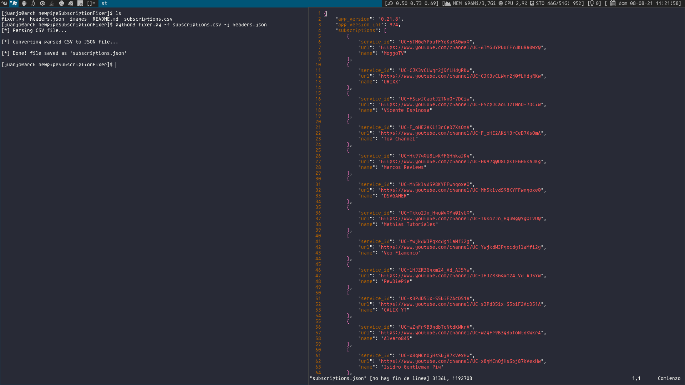

# Newpipe-CSV-Fixer

Convert your Google subscriptions CSV file into a valid JSON for Newpipe!

Thanks to [nikcorg](https://www.reddit.com/r/NewPipe/comments/oprw6d/google_takeouts_exporting_in_csv_format/h7qlevp?utm_source=share&utm_medium=web2x&context=3) for sharing how
to convert the CSV into a NewPipe valid JSON. This is an automation of his guide.

## Table of contents

* [General info](#general-info)
* [Setup](#setup)
* [Parameters](#parameters)
* [Main issues](#main-issues)
* [Alternatives](#alternatives)

## General info

### What's the process of making a NewPipe valid JSON?

- First of all, the 3 column names of the CSV must be changed to ***service_id,url,name***.
- Then, all "http" ocurrencies have to be changed changed to "https".
- After that, the parsed CSV is converted into a JSON, that is appended into a empty list
in the NewPipe JSON header ***{"app_version":"x.xx.x","app_version_int":xxx"","subscriptions":[]}*** .

## Setup

> NOTE: No requirements needed, as they are already in the python standart lib

### Export your (empty) NewPipe subscription list

You will get something like:

> {"app_version":"0.21.7","app_version_int":973,"subscriptions":[]}

Those are the headers needed to convert the CSV into a NewPipe valid JSON, as the version declared 
in the JSON must coincide with the NewPipe app version.

### Move your CSV subscription file and json header to the source dir and execute the script:

`$ python3 fixer.py -f [filename.csv] -j [header.json]`

If you're on Windows, you can execute instead:

`friendlyFixer.cmd`

## Import your subscription file:

## Parameters

- ***-f / --file*** (The csv that contains the subscriptions)
- ***-j / --jsonHeader*** (The exported json from NewPipe that includes the headers)
- ***-e / --encoding*** (To specify the file encoding) 

## Main issues

### In case of getting ***UnicodeDecodeError***, try encoding with cp437 or other:
 
`$ python3 fixer.py -f [filename.csv] -j [header.json] -e "cp437"`

## Alternatives

[juandarr](https://github.com/juandarr) has done a website alternative for this script.
It may be more convenient for some people, specially for those who are not used to using the terminal.

 - [link here](https://juandarr.github.io/json-youtube-export/)

